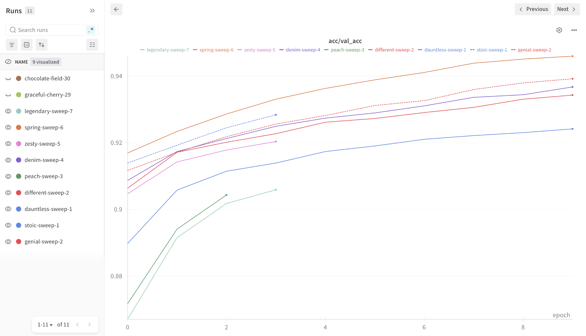
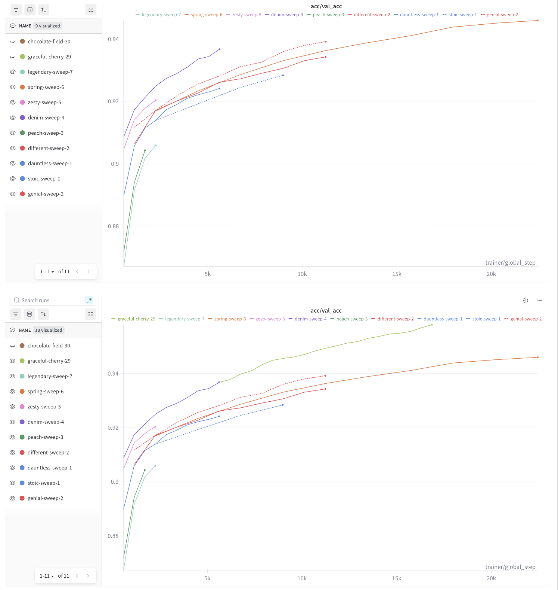
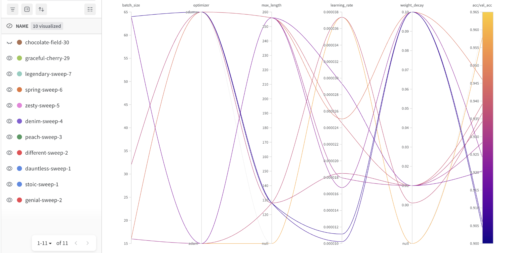
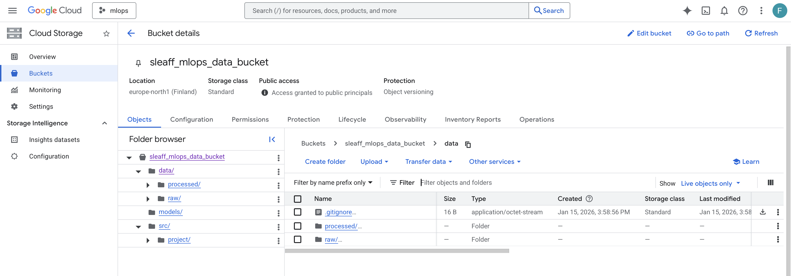
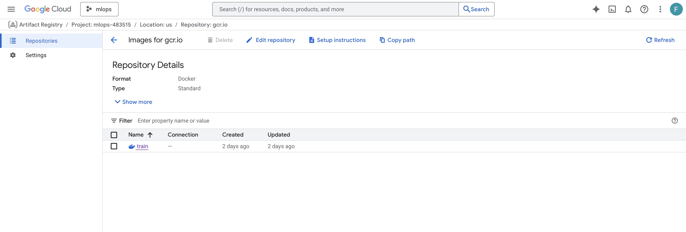
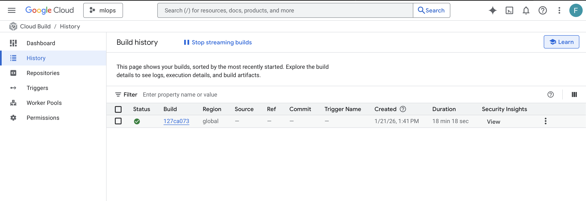

# Exam template for 02476 Machine Learning Operations

This is the report template for the exam. Please only remove the text formatted as with three dashes in front and behind
like:

```--- question 1 fill here ---```

Where you instead should add your answers. Any other changes may have unwanted consequences when your report is
auto-generated at the end of the course. For questions where you are asked to include images, start by adding the image
to the `figures` subfolder (please only use `.png`, `.jpg` or `.jpeg`) and then add the following code in your answer:

``

In addition to this markdown file, we also provide the `report.py` script that provides two utility functions:

Running:

```bash
python report.py html
```

Will generate a `.html` page of your report. After the deadline for answering this template, we will auto-scrape
everything in this `reports` folder and then use this utility to generate a `.html` page that will be your serve
as your final hand-in.

Running

```bash
python report.py check
```

Will check your answers in this template against the constraints listed for each question e.g. is your answer too
short, too long, or have you included an image when asked. For both functions to work you mustn't rename anything.
The script has two dependencies that can be installed with

```bash
pip install typer markdown
```

or

```bash
uv add typer markdown
```

## Overall project checklist

The checklist is *exhaustive* which means that it includes everything that you could do on the project included in the
curriculum in this course. Therefore, we do not expect at all that you have checked all boxes at the end of the project.
The parenthesis at the end indicates what module the bullet point is related to. Please be honest in your answers, we
will check the repositories and the code to verify your answers.

### Week 1

* [x] Create a git repository (M5)
* [x] Make sure that all team members have write access to the GitHub repository (M5)
* [x] Create a dedicated environment for you project to keep track of your packages (M2)
* [x] Create the initial file structure using cookiecutter with an appropriate template (M6)
* [x] Fill out the `data.py` file such that it downloads whatever data you need and preprocesses it (if necessary) (M6)
* [x] Add a model to `model.py` and a training procedure to `train.py` and get that running (M6)
* [x] Remember to fill out the `requirements.txt` and `requirements_dev.txt` file with whatever dependencies that you
    are using (M2+M6)
* [x] Remember to comply with good coding practices (`pep8`) while doing the project (M7)
* [x] Do a bit of code typing and remember to document essential parts of your code (M7)
* [x] Setup version control for your data or part of your data (M8)
* [x] Add command line interfaces and project commands to your code where it makes sense (M9)
* [x] Construct one or multiple docker files for your code (M10)
* [x] Build the docker files locally and make sure they work as intended (M10)
* [x] Write one or multiple configurations files for your experiments (M11)
* [x] Used Hydra to load the configurations and manage your hyperparameters (M11)
* [x] Use profiling to optimize your code (M12)
* [x] Use logging to log important events in your code (M14)
* [x] Use Weights & Biases to log training progress and other important metrics/artifacts in your code (M14)
* [x] Consider running a hyperparameter optimization sweep (M14)
* [x] Use PyTorch-lightning (if applicable) to reduce the amount of boilerplate in your code (M15)

### Week 2

* [x] Write unit tests related to the data part of your code (M16)
* [x] Write unit tests related to model construction and or model training (M16)
* [x] Calculate the code coverage (M16)
* [x] Get some continuous integration running on the GitHub repository (M17)
* [x] Add caching and multi-os/python/pytorch testing to your continuous integration (M17)
* [x] Add a linting step to your continuous integration (M17)
* [x] Add pre-commit hooks to your version control setup (M18)
* [ ] Add a continues workflow that triggers when data changes (M19)
* [ ] Add a continues workflow that triggers when changes to the model registry is made (M19)
* [x] Create a data storage in GCP Bucket for your data and link this with your data version control setup (M21)
* [x] Create a trigger workflow for automatically building your docker images (M21)
* [x] Get your model training in GCP using either the Engine or Vertex AI (M21)
* [x] Create a FastAPI application that can do inference using your model (M22)
* [ ] Deploy your model in GCP using either Functions or Run as the backend (M23)
* [x] Write API tests for your application and setup continues integration for these (M24)
* [x] Load test your application (M24)
* [ ] Create a more specialized ML-deployment API using either ONNX or BentoML, or both (M25)
* [x] Create a frontend for your API (M26)

### Week 3

* [x] Check how robust your model is towards data drifting (M27)
* [ ] Deploy to the cloud a drift detection API (M27)
* [x] Instrument your API with a couple of system metrics (M28)
* [ ] Setup cloud monitoring of your instrumented application (M28)
* [ ] Create one or more alert systems in GCP to alert you if your app is not behaving correctly (M28)
* [x] If applicable, optimize the performance of your data loading using distributed data loading (M29)
* [ ] If applicable, optimize the performance of your training pipeline by using distributed training (M30)
* [ ] Play around with quantization, compilation and pruning for you trained models to increase inference speed (M31)

### Extra

* [ ] Write some documentation for your application (M32)
* [ ] Publish the documentation to GitHub Pages (M32)
* [x] Revisit your initial project description. Did the project turn out as you wanted?
* [x] Create an architectural diagram over your MLOps pipeline
* [x] Make sure all group members have an understanding about all parts of the project
* [x] Uploaded all your code to GitHub

## Group information

### Question 1
> **Enter the group number you signed up on <learn.inside.dtu.dk>**
>
> Answer:

76

### Question 2
> **Enter the study number for each member in the group**
>
> Answer:

s195171 - Kenneth Plum Toft <br>
s242726 - Philip Arthur Blaafjell <br>
s243586 - Joakim Dinh <br>
s242723 - Vebjørn Sæten Skre <br>

### Question 3
> **A requirement to the project is that you include a third-party package not covered in the course. What framework**
> **did you choose to work with and did it help you complete the project?**
>
> Recommended answer length: 100-200 words.
>
> Example:
> *We used the third-party framework ... in our project. We used functionality ... and functionality ... from the*
> *package to do ... and ... in our project*.
>
> Answer:

We used Evidently AI and Hugging Face Transformers as third-party frameworks in our project. Transformers provided the pre-trained DistilBERT model we used for text classification. Instead of building a language model from scratch, we loaded distilbert-base-uncased and added a classifier head on top. This saved us significant time and gave us a strong baseline for our fake news detection task. Evidently was used for data drift detection. We used the DataDriftPreset to compare training data against new data and generate HTML reports showing if distributions have changed. This helps monitor if the model might need retraining. Both packages helped us focus on the MLOps pipeline rather than implementing everything ourselves.

## Coding environment

> In the following section we are interested in learning more about you local development environment. This includes
> how you managed dependencies, the structure of your code and how you managed code quality.

### Question 4

> **Explain how you managed dependencies in your project? Explain the process a new team member would have to go**
> **through to get an exact copy of your environment.**
>
> Recommended answer length: 100-200 words
>
> Example:
> *We used ... for managing our dependencies. The list of dependencies was auto-generated using ... . To get a*
> *complete copy of our development environment, one would have to run the following commands*
>
> Answer:
We used uv to manage our dependencies. The list of dependencies was auto-generated using uv export uv export --no-hashes --format requirements.txt --output-file requirements.txt. To get a complete copy of our development environment one would have to run the following commands:
git clone <repo_url>
cd <repo_folder>
uv install --requirements-file requirements.txt

All of our team menmbers used uv and we had no issues with dependencies.

We had the most issues with dependencies towards cloud related access. Such as working in the same GCP project and having the right permissions to buckets. We had issues granting access to DVC remote buckets so we had to make the buckets public for easier access.

### Question 5

> **We expect that you initialized your project using the cookiecutter template. Explain the overall structure of your**
> **code. What did you fill out? Did you deviate from the template in some way?**
>
> Recommended answer length: 100-200 words
>
> Example:
> *From the cookiecutter template we have filled out the ... , ... and ... folder. We have removed the ... folder*
> *because we did not use any ... in our project. We have added an ... folder that contains ... for running our*
> *experiments.*
>
> Answer:
We started with the cookiecutter template from the course (https://github.com/SkafteNicki/mlops_template) and built our project from there. The main stuff we filled out was `src/project/` with the usual files `model.py`, `train.py`, `data.py`, `dataset.py`, and `api.py` for the core functionality. We made a `configs/` folder with `config.yaml` for Hydra to handle hyperparameters, which was super useful for running different experiments without changing code. We created `dockerfiles/` for both training and the API. For testing we split things into `tests/unittests/` (quick tests that run in CI) and `tests/integration/` (slower tests with the actual model).

We used DVC to version control our data. The processed news dataset lives in `data/processed/` and trained models in `models/`. The main thing we changed from the template was using `uv` for dependencies instead of pip, which worked way better for us. We also added a `scripts/` folder for some bash scripts to run training in the cloud. Finally, we set up a bunch of GitHub Actions workflows in `.github/workflows/` to automatically run tests, linting, and pre-commit checks whenever we pushed code. Everything's organized pretty cleanly with data, models, code, and tests in separate places.

### Question 6

> **Did you implement any rules for code quality and format? What about typing and documentation? Additionally,**
> **explain with your own words why these concepts matters in larger projects.**
>
> Recommended answer length: 100-200 words.
>
> Example:
> *We used ... for linting and ... for formatting. We also used ... for typing and ... for documentation. These*
> *concepts are important in larger projects because ... . For example, typing ...*
>
> Answer:
We used Ruff for linting and code formatting through pre-commit hooks. Ruff runs automatically before every commit to check our code style and fix common issues like unused imports or incorrect spacing. We configured it in pyproject.toml with a 120-character line length. Our pre-commit setup also checks for trailing whitespace and validates YAML files. We added some type hints to important functions but didn't go crazy with it everywhere. For documentation, we wrote docstrings explaining what our main functions do in model.py, train.py, and api.py.

These things are pretty important when working in a group. Without formatting rules, everyone writes code differently and merge conflicts can become a nightmare. Linting catches silly mistakes before they break anything. Type hints help when you come back to code after a week and forgot what parameters a function needs. In our team of four people, having these tools meant we could work on different parts without constantly asking "what does this function expect?" or "why is this failing?". It made code reviews faster since we could focus on actual logic instead of arguing about spaces vs tabs.

## Version control

> In the following section we are interested in how version control was used in your project during development to
> corporate and increase the quality of your code.

### Question 7

> **How many tests did you implement and what are they testing in your code?**
>
> Recommended answer length: 50-100 words.
>
> Example:
> *In total we have implemented X tests. Primarily we are testing ... and ... as these the most critical parts of our*
> *application but also ... .*
>
> Answer:

We added a model test, which checks if the model weights change during training. We feed the model a some dummy inputs and labels to see if the weights change. Indicating if our training loop works.

Later we added an inference tester which tested if two sample inputs produced an expected output. However this test was removed as when it was added to github action it could not load the model due to the model being git ignored.

### Question 8

> **What is the total code coverage (in percentage) of your code? If your code had a code coverage of 100% (or close**
> **to), would you still trust it to be error free? Explain you reasoning.**
>
> Recommended answer length: 100-200 words.
>
> Example:
> *The total code coverage of code is X%, which includes all our source code. We are far from 100% coverage of our **
> *code and even if we were then...*
>
> Answer:
Name                      Stmts   Miss  Cover   Missing
-------------------------------------------------------
src/project/__init__.py       0      0   100%
src/project/dataset.py       16      0   100%
src/project/model.py         49     15    69%   48-62, 65-72
-------------------------------------------------------
TOTAL                        65     15    77%

We had a total code coverage of 77%. There were also some warnings which we ignored because they were not relevant to our project. These are warnings such as not using the validation function or changing the amount of workers. Even if our coverage was 100% we would still not trust it to be error free. Code coverage only shows which lines of code are executed during testing, not if the tests are meaningful or if all edge cases are covered. There were also many files which are not covered at all and some tests which were removed for simplicity

### Question 9

> **Did you workflow include using branches and pull requests? If yes, explain how. If not, explain how branches and**
> **pull request can help improve version control.**
>
> Recommended answer length: 100-200 words.
>
> Example:
> *We made use of both branches and PRs in our project. In our group, each member had an branch that they worked on in*
> *addition to the main branch. To merge code we ...*
>
> Answer:

  Yes, we used branches and pull requests. We followed a feature branch workflow
  with PRs for larger features. Dependabot automated dependency update PRs, and CI ran tests before merging.

  However, several areas could be improved. Some commits went directly to main without PRs (like quick fixes, config
  changes), bypassing code review. This happened when changes felt too small for a PR, but does not follow the
  workflows purpose. Our commit messages were sometimes a bit vague ("fixed the uv.lock file") rather than explaining why
  changes were made. Branch naming was also someimes inconsistent as not all branches followed the type/description convention.

  For future projects, we would enforce stricter branch protection (no direct pushes to main), require more
  descriptive commit messages focusing on intent, and establish clearer PR templates with checklists.
  We could also consider implementing a dev branch between main and features to protect main more, especially since it is suppsoed to be deployable production code.
  Even small changes benefit from the PR process. It creates documentation and allows teammates to stay informed. The work
  of making a PR is minimal compared to the information and trackability it provides.

### Question 10

> **Did you use DVC for managing data in your project? If yes, then how did it improve your project to have version**
> **control of your data. If no, explain a case where it would be beneficial to have version control of your data.**
>
> Recommended answer length: 100-200 words.
>
> Example:
> *We did make use of DVC in the following way: ... . In the end it helped us in ... for controlling ... part of our*
> *pipeline*
>
> Answer:
We used DVC for data and model version control. We started out using Google Drive as our remote storage, which was easy to set up initially. Later we switched to Google Cloud Storage buckets to better integrate with the rest of our GCP setup and keep everything in one place.

DVC helped us a lot because we could keep our 40k+ news articles and trained model checkpoints out of git. Instead we just track small `.dvc` files that point to where the actual data lives in the cloud. This meant our git repo stayed small and fast. When someone new joined or when we ran training in the cloud, we could just use `dvc pull` and get the latest data and models without having to manually download anything or ask someone to share files.

The best part was that we could version our data just like code, if we later reprocess the dataset or train a new model, DVC can track those changes. We could also go back to an older version if needed. It also made our CI/CD pipeline simpler since workflows could pull the exact data version needed for testing.

### Question 11

> **Discuss you continuous integration setup. What kind of continuous integration are you running (unittesting,**
> **linting, etc.)? Do you test multiple operating systems, Python  version etc. Do you make use of caching? Feel free**
> **to insert a link to one of your GitHub actions workflow.**
>
> Recommended answer length: 200-300 words.
>
> Example:
> *We have organized our continuous integration into 3 separate files: one for doing ..., one for running ... testing*
> *and one for running ... . In particular for our ..., we used ... .An example of a triggered workflow can be seen*
> *here: <weblink>*
>
> Answer:
We split our CI into separate workflow files in `.github/workflows/`. The main ones are `tests.yaml` for unit testing, `linting.yaml` for code quality checks. Both trigger on pushes to main and on pull requests, so we catch issues before they get merged. Another important one is and `integration-tests.yaml` for testing with actual trained models and real data, which runs automatically every sunday and manually if needed.

For unit testing (tests.yaml), we test across multiple operating systems - ubuntu, windows, and macos - all with Python 3.13. We use uv's built-in caching (`enable-cache: true`) which speeds things up by not re-downloading dependencies every time. The workflow runs our unit tests with pytest and generates a coverage report showing which parts of our code are actually tested. We intentionally removed DVC data pulling from this unit testing workflow to keep tests fast and isolated, our unit tests then use mocked data instead of real files.

For linting (linting.yaml), we run Ruff to check code formatting and automatically fix small issues. This catches stuff like unused imports or inconsistent spacing before anyone even reviews the code. We also have pre-commit hooks that run similar checks locally, so ideally these linting workflows should just pass.

We originally had more complex CI setup that pulled data from DVC and tested with real models, but we realized that was more of an integration test thing. Now our CI is much faster, unit tests finish in under a minute usually. An example run can be seen at https://github.com/Sleaff/ml-ops-project/actions.

## Running code and tracking experiments

> In the following section we are interested in learning more about the experimental setup for running your code and
> especially the reproducibility of your experiments.

### Question 12

> **How did you configure experiments? Did you make use of config files? Explain with coding examples of how you would**
> **run a experiment.**
>
> Recommended answer length: 50-100 words.
>
> Example:
> *We used a simple argparser, that worked in the following way: Python  my_script.py --lr 1e-3 --batch_size 25*
>
> Answer:

We used Hydra for experiment configuration. Hyperparameters are stored in YAML config files under configs/. This separates configuration from code and makes it easy to change settings without editing Python files. To run an experiment with default settings: uv run python src/project/train.py
To override parameters from command line: uv run python src/project/train.py model.lr=1e-4 training.batch_size=16 training.max_epochs=5
Hydra also logs the full config for each run, making experiments reproducible.


### Question 13

> **Reproducibility of experiments are important. Related to the last question, how did you secure that no information**
> **is lost when running experiments and that your experiments are reproducible?**
>
> Recommended answer length: 100-200 words.
>
> Example:
> *We made use of config files. Whenever an experiment is run the following happens: ... . To reproduce an experiment*
> *one would have to do ...*
>
> Answer:

We used several tools to ensure reproducibility:
Hydra automatically saves the full configuration for each run in an outputs/ folder with timestamps. This means we always know exactly what parameters were used.
Weights & Biases logs all training metrics, hyperparameters, and system info to the cloud. Each run gets a unique ID and we can compare runs in the W&B dashboard. The config is also stored there.
                                                                                                                                                                        DVC tracks our dataset versions. The data is stored in a GCS bucket and DVC keeps track of which version was used. This ensures we can always get back the exact data used for training.
                                                                                                                                                                        Git tracks all code changes. Combined with the logged configs and data versions, we can recreate any experiment.
  To reproduce an experiment, one would:
  1. Checkout the correct git commit
  2. Run dvc pull to get the right data version
  3. Copy the saved Hydra config and run training with those parameters
  4. Or find the run in W&B and use the logged config

### Question 14

> **Upload 1 to 3 screenshots that show the experiments that you have done in W&B (or another experiment tracking**
> **service of your choice). This may include loss graphs, logged images, hyperparameter sweeps etc. You can take**
> **inspiration from [this figure](figures/wandb.png). Explain what metrics you are tracking and why they are**
> **important.**
>
> Recommended answer length: 200-300 words + 1 to 3 screenshots.
>
> Example:
> *As seen in the first image when have tracked ... and ... which both inform us about ... in our experiments.*
> *As seen in the second image we are also tracking ... and ...*
>
> Answer:

We used WandB to track our hyper parameter sweep experiments. Looking at the first image we compare validation accuracy of different sets of hyper parameters over epochs. To get a feel for what hyperparameters was working well we ran 9 different sets of configurations and ran the training for 10 epochs to see their performance. We used WanB’s built-in gaussian search method to select hyper parameters within specified ranges. Looking at the first image we compare validation accuracy over number of epochs. This plot would suggest the topmost line «spring-sweep-6» to be most promising, however, as we varied the batch size as a hyp-parameter, image number 2 showes another story. In the topmost figure in image 2 we plotted validation accuracies over optimizer steps rather than epochs, where we can see that the run «denim-sweep-4» actually learned much faster, but had less optimizer steps than «spring-sweep-6». Thus we created another run with the exact same hyp-param configuration as «denim-sweep-4», and ran it for more epoch. The result of which can be viewed as the green line bottom figure of image 2 «graceful-cherry-29», clearly showing superior performance compared to the other configurations. Image three shows how the different parameters correlate to the validation accuracy. A trend is that too large weight decay and too low learning rate is bad for model performance.

Our best run was «graceful-cherry-29» which achieved a validation accuracy of 96% after around 30 epochs, or 15k steps, of fine tuning. From other plots comparing validation and training loss, there was no sign of overfitting and sustained training would probably make the model performance continue the upward trend.

Image 1:  


Image 2:  


Image 3:  


### Question 15

> **Docker is an important tool for creating containerized applications. Explain how you used docker in your**
> **experiments/project? Include how you would run your docker images and include a link to one of your docker files.**
>
> Recommended answer length: 100-200 words.
>
> Example:
> *For our project we developed several images: one for training, inference and deployment. For example to run the*
> *training docker image: `docker run trainer:latest lr=1e-3 batch_size=64`. Link to docker file: <weblink>*
>
> Answer:

We developed two Docker images: one for training and one for the inference API. The training image includes Google Cloud SDK and is used for cloud training on GCP. It copies the code, configs, and runs a training script. We use it on a GPU VM in GCP:

    docker build -f dockerfiles/train.dockerfile -t train:latest .                                                                                                          docker run --gpus all train:latest
The API image packages the FastAPI application with the model. It uses DVC to pull the trained model during build. To run locally:

    docker build -f dockerfiles/api.dockerfile -t news-api .                                                                                                                docker run -p 8000:8000 news-api
Both images use uv as the package manager with a slim Python 3.12 base image. The training image is automatically built via GitHub Actions and pushed to Google Container Registry when code changes. Link to API dockerfile: https://github.com/[your-repo]/blob/main/dockerfiles/api.dockerfile

### Question 16

> **When running into bugs while trying to run your experiments, how did you perform debugging? Additionally, did you**
> **try to profile your code or do you think it is already perfect?**
>
> Recommended answer length: 100-200 words.
>
> Example:
> *Debugging method was dependent on group member. Some just used ... and others used ... . We did a single profiling*
> *run of our main code at some point that showed ...*
>
> Answer:

Our debugging process focused on ensuring integrity of the training loop and data. We implemented a «test_model()» function to verify that model parameters changed during training by comparing the initial state of the weight with the state after a short run. We also included a «test_news_dataset()» function that verified our dataset was of correct type. For errors during code development we used VS codes debugging feature. To maintain structure and an organized track record we made use of pythons logging library and saved prints in these log files with dates and times.


When running training in the hpc each epoch took around 1-1,5 minutes. To inspect if we could increase the efficiency of our code we made use of code profiling. We used hydra to switch between simple, advanced and PyTorch profiling tools, allowing us to create detailed reports of the code performance, from which we saw that there was a huge CPU overhead. To mitigate this bottleneck we made adjustments to our data loaders, by setting num_workers=4, pin_memory=True and persisten_workers=True. This reduced the CPU overhead and made our training more than 3.3 times faster, with each epoch taking around 18 seconds.


## Working in the cloud

> In the following section we would like to know more about your experience when developing in the cloud.

### Question 17

> **List all the GCP services that you made use of in your project and shortly explain what each service does?**
>
> Recommended answer length: 50-200 words.
>
> Example:
> *We used the following two services: Engine and Bucket. Engine is used for... and Bucket is used for...*
>
> Answer:

We used the following GCP services:
Cloud Storage (GCS Bucket) - Stores our training data and trained model checkpoints. The bucket gs://sleaff_mlops_data_bucket/ holds the dataset and model files that are downloaded during training and inference.
                                                                                                                                                                        Compute Engine - Provides a VM with a T4 GPU for training. We run a SPOT instance to reduce costs. The VM pulls our Docker image and runs training jobs.
Container Registry (GCR) - Stores our Docker images. When we build a new training image, it gets pushed to gcr.io/mlops-483515/train:latest so the VM can pull it.
Cloud Build - Automatically builds Docker images when triggered. Connected to our GitHub repo for CI/CD.
Cloud Run - Infrastructure is set up for deploying the API as a serverless container, though not actively deployed to save costs.

### Question 18

> **The backbone of GCP is the Compute engine. Explained how you made use of this service and what type of VMs**
> **you used?**
>
> Recommended answer length: 100-200 words.
>
> Example:
> *We used the compute engine to run our ... . We used instances with the following hardware: ... and we started the*
> *using a custom container: ...*
>
> Answer:

We used Compute Engine to run model training with GPU acceleration. Training a DistilBERT model on CPU is slow, so we needed a GPU instance.
We created a VM called mlops-training-vm in us-west1-b with the following specs:
  - GPU: NVIDIA T4 (16GB VRAM)
  - Instance type: SPOT (preemptible) to reduce costs
  - Cost: ~$0.40/hour when running
  - OS: Standard Linux with Docker and NVIDIA drivers installed
he workflow is:
  1. SSH into the VM via gcloud compute ssh
  2. Pull the training Docker image from GCR (gcr.io/mlops-483515/train:latest)
  3. Download data from GCS bucket
  4. Run training with docker run --gpus all
  5. Upload model checkpoints back to GCS
  6. Stop the VM to save money
We used SPOT instances because our training jobs are short and can handle interruptions. If preempted, we just restart. This saved significant costs compared to regular instances.

### Question 19

> **Insert 1-2 images of your GCP bucket, such that we can see what data you have stored in it.**
> **You can take inspiration from [this figure](figures/bucket.png).**
>
> Answer:



### Question 20

> **Upload 1-2 images of your GCP artifact registry, such that we can see the different docker images that you have**
> **stored. You can take inspiration from [this figure](figures/registry.png).**
>
> Answer:



### Question 21

> **Upload 1-2 images of your GCP cloud build history, so we can see the history of the images that have been build in**
> **your project. You can take inspiration from [this figure](figures/build.png).**
>
> Answer:



### Question 22

> **Did you manage to train your model in the cloud using either the Engine or Vertex AI? If yes, explain how you did**
> **it. If not, describe why.**
>
> Recommended answer length: 100-200 words.
>
> Example:
> *We managed to train our model in the cloud using the Engine. We did this by ... . The reason we choose the Engine*
> *was because ...*
>
> Answer:

Yes, we trained our model using Compute Engine. We chose Compute Engine over Vertex AI because it was the simpler solution and easier to understand for our team. We had some issues at first with CPU instances - training was too slow. We then tried to get a GPU instance but faced availability issues. We switched to a SPOT instance with a T4 GPU which had better availability and lower cost.

The workflow is: push Docker image to Container Registry, SSH into the VM, pull image, download data from GCS, run training with GPU, upload model back to GCS. We wrapped this in an invoke command (uv run invoke gcloud-train --gpu) so teammates can run training with one command.

## Deployment

### Question 23

> **Did you manage to write an API for your model? If yes, explain how you did it and if you did anything special. If**
> **not, explain how you would do it.**
>
> Recommended answer length: 100-200 words.
>
> Example:
> *We did manage to write an API for our model. We used FastAPI to do this. We did this by ... . We also added ...*
> *to the API to make it more ...*
>
> Answer:

We managed to write an API for our model using FastAPI. We are using a language model thus we need to input some text. Thus the requester needs to add a title and a text which they want to figure out if its fake or real news. We did this by adding a post method to the API which then feeds the text to a preloaded model which runs through the lifespan of the API. We also added a get method to check the model parameters to see if it they were loaded correctly. To make the API we had to make a prediction function which was simply since we had already implemented pytorch lightning.

### Question 24

> **Did you manage to deploy your API, either in locally or cloud? If not, describe why. If yes, describe how and**
> **preferably how you invoke your deployed service?**
>
> Recommended answer length: 100-200 words.
>
> Example:
> *For deployment we wrapped our model into application using ... . We first tried locally serving the model, which*
> *worked. Afterwards we deployed it in the cloud, using ... . To invoke the service an user would call*
> *`curl -X POST -F "file=@file.json"<weburl>`*
>
> Answer:

We tried to get our API to run on a docker container. However we were having issues with loading our pretrained model into the docker run API. However we managed to run the API on a local network which could sitll be loaded through docker. 

We  made the docker image like this:
sudo docker build -f dockerfiles/api.dockerfile . -t api:latest

And started the API at a specified adress like this. 
sudo docker run -p 8080:8000 api:latest

We could then post requests to our server using the python package "requests"

We unfortunately did not have time to implement it into the cloud but we would had created a service to run our container and then changed the url of the python package to match the gcp service url.

### Question 25

> **Did you perform any unit testing and load testing of your API? If yes, explain how you did it and what results for**
> **the load testing did you get. If not, explain how you would do it.**
>
> Recommended answer length: 100-200 words.
>
> Example:
> *For unit testing we used ... and for load testing we used ... . The results of the load testing showed that ...*
> *before the service crashed.*
>
> Answer:

We tried load testing while running the API on locally. For this we used locust. We wrote a locust performance test script to feed our API with random datapoints in our dataset to similate each request to the API. We tested with 10 users at the same time sending requests, getting around 0.7 requests per second. The API handeled it very well, but after adding too many worker eventually the API crashed. We found that the response time increased dramatically when first adding users while it started to lower and stabilize after a while. An image is attatched below for reference. 


### Question 26

> **Did you manage to implement monitoring of your deployed model? If yes, explain how it works. If not, explain how**
> **monitoring would help the longevity of your application.**
>
> Recommended answer length: 100-200 words.
>
> Example:
> *We did not manage to implement monitoring. We would like to have monitoring implemented such that over time we could*
> *measure ... and ... that would inform us about this ... behaviour of our application.*
>
> Answer:

Yes, we implemented basic monitoring using Prometheus metrics in our FastAPI application. The API exposes a /metrics endpoint with the following metrics:
- api_requests_total - Counter for total requests by endpoint                                                                                                          - api_request_latency_seconds - Histogram tracking response times                                                                                                      - api_predictions_total - Counter for predictions by class (REAL/FAKE)

This lets us track how many requests the API handles, how fast it responds, and the distribution of predictions. If suddenly most predictions are FAKE, it could indicate something is wrong.

We did not fully set up cloud monitoring with GCP Cloud Monitoring and alerts. If we had more time, we would connect the Prometheus metrics to GCP Monitoring and create alerts for things like high latency (>5s) or high error rates. This would help us catch issues before users complain and ensure the model keeps performing well over time.

## Overall discussion of project

> In the following section we would like you to think about the general structure of your project.

### Question 27

> **How many credits did you end up using during the project and what service was most expensive? In general what do**
> **you think about working in the cloud?**
>
> Recommended answer length: 100-200 words.
>
> Example:
> *Group member 1 used ..., Group member 2 used ..., in total ... credits was spend during development. The service*
> *costing the most was ... due to ... . Working in the cloud was ...*
>
> Answer:

--- question 27 fill here ---

### Question 28

> **Did you implement anything extra in your project that is not covered by other questions? Maybe you implemented**
> **a frontend for your API, use extra version control features, a drift detection service, a kubernetes cluster etc.**
> **If yes, explain what you did and why.**
>
> Recommended answer length: 0-200 words.
>
> Example:
> *We implemented a frontend for our API. We did this because we wanted to show the user ... . The frontend was*
> *implemented using ...*
>
> Answer:

Yes, we implemented a frontend for our API using the ML-specific Gradio library. We wanted users to easily test the fake news classifier without needing to make API calls manually. The frontend has a simple interface where you enter a title and text, click submit, and get a prediction. We also added 10 example news articles from our dataset so users can quickly test with real data.

### Question 29

> **Include a figure that describes the overall architecture of your system and what services that you make use of.**
> **You can take inspiration from [this figure](figures/overview.png). Additionally, in your own words, explain the**
> **overall steps in figure.**
>
> Recommended answer length: 200-400 words
>
> Example:
>
> *The starting point of the diagram is our local setup, where we integrated ... and ... and ... into our code.*
> *Whenever we commit code and push to GitHub, it auto triggers ... and ... . From there the diagram shows ...*
>
> Answer:

The diagram shows the complete architecture of our system. To the left in the diagram we have our developer playground where we work on the code and develop features and scripts. When making changes, or adding functionality to the code or data, we track these changes using GitHub and Data version control. In GitHub we make feature branches and merge them to main upon completion of tasks. As we are creating pull requests, we utilize GitHub Actions to automatically run continuous integration workflows, including code linting, unit tests, and integration tests (automatic every Sunday, otherwise manual), ensuring that new changes meet quality and correctness requirements before being merged. When it comes to data versioning the metadata gets uploaded to GitHub while the actual data gets stored in google cloud. 

Model training is executed in the cloud using Google Cloud Compute Engine. Training jobs are configured using Hydra, which allows structured configuration management and reproducible experiments. During training, Weights & Biases (W&B) is used to log metrics, hyperparameters, and experiment artifacts including hyperparameter sweeps. Training is performed using PyTorch Lightning, and once training is complete, the best-performing model checkpoint is saved to the GCS bucket. 

The inference code is built into a Docker image, ensuring a reproducible and isolated runtime environment with all required dependencies. When executed, this image loads the trained model checkpoint from the Google Cloud Storage (GCS) bucket and uses it to perform inference. As a user, an API request is sent to the system through FastAPI, where the request is processed using the Docker image and the loaded model. The prediction is then returned as an HTTP response. Gradio is used to provide a lightweight graphical user interface on top of the API, allowing users to interact with the model without directly issuing API calls.

### Question 30

> **Discuss the overall struggles of the project. Where did you spend most time and what did you do to overcome these**
> **challenges?**
>
> Recommended answer length: 200-400 words.
>
> Example:
> *The biggest challenges in the project was using ... tool to do ... . The reason for this was ...*
>
> Answer:

The biggest struggles in our project came from three main areas: version control coordination, cloud GPU availability, and keeping track of how all the different tools connect together.
  
At the start, version control was messy. We had four people working on different parts and sometimes pushed directly to main instead of using feature branches. This caused merge conflicts and made it hard to track what changed. We got better at this over time by enforcing pull requests and code reviews, but early commits were inconsistent and sometimes vague. Learning to work as a team with git took some adjustment.                                                      

Cloud training was another challenge. We first tried CPU instances on GCP but training our DistilBERT model was painfully slow. When we tried to get GPU instances, we ran into availability issues - the T4 GPUs we wanted were often not available in our chosen region. We eventually switched to SPOT instances which had better availability and lower cost, but they can be preempted mid-training. We had to make sure our training could handle interruptions and save checkpoints frequently.                                                                                                                                                                              The hardest part was keeping track of how everything fits together. We used many different tools: git for code, DVC for data, Hydra for configs, W&B for experiment tracking, Docker for containers, GCP for cloud resources, GitHub Actions for CI/CD. Each tool is simple on its own, but making them all work together smoothly was overwhelming at times, and with so many new tools, it was hard to connect what tool was resonisble for what and why. What overlaps with eachother? When something broke, it was often unclear which part of the pipeline was the problem. Was it a DVC authentication issue? A Docker build failure? A missing config? Debugging across multiple tools and services took a lot of time.                                                                                                                                      
We overcame these challenges by documenting everything, creating invoke commands to automate common workflows, and having good communcation. By the end of the project, we had a much better understanding of how MLOps pipelines work in practice!

### Question 31

> **State the individual contributions of each team member. This is required information from DTU, because we need to**
> **make sure all members contributed actively to the project. Additionally, state if/how you have used generative AI**
> **tools in your project.**
>
> Recommended answer length: 50-300 words.
>
> Example:
> *Student sXXXXXX was in charge of developing of setting up the initial cookie cutter project and developing of the*
> *docker containers for training our applications.*
> *Student sXXXXXX was in charge of training our models in the cloud and deploying them afterwards.*
> *All members contributed to code by...*
> *We have used ChatGPT to help debug our code. Additionally, we used GitHub Copilot to help write some of our code.*
> Answer:
>

Student s243586 was in charge of implementing pytorch lightning to simplify the training pipeline, developing the API and load testing it, creating docker containers for training and API.

Student s242726 was in charge of the core ML pipeline (data preprocessing, dataset, model, training), Hydra configuration, GCP cloud training with GPU support, Prometheus API monitoring, Evidently drift detection, and the Gradio frontend. This student used Claude Code (Claude AI) to assist with development. It helped with writing some code, debugging errors, navigating GCP cloud training infrastructure, and implementing features like Prometheus monitoring and Evidently drift 
detection. It was also useful for quickly understanding unfamiliar libraries and generating documentation. Code was always reviewed and tested before committing! [Claude Code](https://code.claude.com/docs/en/setup)

Student s195171 was in charge of version control setup and initial DevOps infrastructure. GitHub repository structure, configuring Git workflows with branch protection and PR templates, implementing DVC for data versioning, and creating the CI/CD pipeline with GitHub Actions. Also developed the testing infrastructure including unit tests, integration tests. Set up pre-commit hooks, linting workflows, and automated dependency updates with Dependabot.

Student s242723 was in charge of logging, debugging and profiling code. Training models and doing hyperparemter optimalization on the hpc, keeping track of experiments with Weights and Biases and analyzing the results. Also worked on imporivng developing workflow with invoke commands.
